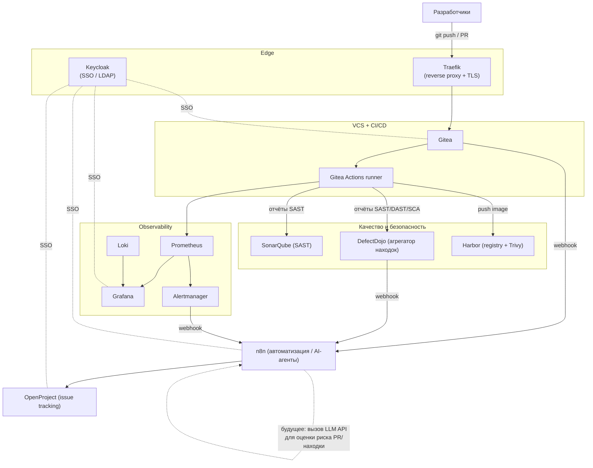

# Архитектура платформы

## Диаграмма



## Зачем такой набор инструментов

Все сервисы держатся на одной внешней docker-сети `devops_edge` и роутятся
через Traefik по поддоменам, чтобы:

- добавлять/выключать любой сервис независимо (модульные `docker-compose.*.yml`);
- у каждого сервиса был отдельный TLS-сертификат (Let's Encrypt через Traefik) без ручной настройки nginx;
- SSO через Keycloak не давал командам заводить отдельные учётки в каждом инструменте.

| Слой | Инструмент | Роль | Почему не альтернатива |
|---|---|---|---|
| Reverse proxy / TLS | Traefik | единая точка входа, авто-TLS | легче nginx+certbot в docker-окружении |
| SSO | Keycloak | единый вход во все инструменты | GitLab/Jira решают это только внутри себя, здесь нужен общий слой |
| VCS + CI/CD | Gitea + Actions | git, PR, пайплайны (YAML совместим с GitHub Actions) | GitLab CE закрыл бы это же, но требует значительно больше RAM (от ~8GB только под GitLab) — на 10-50 разработчиков Gitea достаточно |
| Issue tracking | OpenProject | бэклог, доски, роадмапы | реальный self-hosted Jira Server Atlassian больше не продаёт новым клиентам |
| Code quality/SAST | SonarQube | статический анализ, quality gates в пайплайне | |
| Vulnerability mgmt | DefectDojo | агрегация SAST/DAST/SCA отчётов, дедупликация находок | см. `adding-defectdojo-harbor.md` — не вендорим compose, ставим официальным installer'ом |
| Container registry | Harbor | registry + Trivy sca на пуше образа | см. `adding-defectdojo-harbor.md` |
| Мониторинг | Prometheus/Grafana/Loki/Alertmanager | метрики, логи, алерты | стандарт де-факто, огромная экосистема экспортеров |
| Автоматизация | n8n | склейка вебхуков между всеми инструментами, площадка для будущих AI-агентов | low-code, не пишем интеграционный код руками |

## Пример пайплайна Gitea Actions с публикацией в DefectDojo/SonarQube

```yaml
# .gitea/workflows/ci.yml (в репозитории конкретного проекта)
name: CI
on: [pull_request, push]
jobs:
  build-test-scan:
    runs-on: docker
    steps:
      - uses: actions/checkout@v4
      - run: npm ci && npm test
      - name: SonarQube scan
        uses: sonarsource/sonarqube-scan-action@v3
        env:
          SONAR_HOST_URL: https://sonar.${BASE_DOMAIN}
          SONAR_TOKEN: ${{ secrets.SONAR_TOKEN }}
      - name: Trivy image scan -> DefectDojo
        run: |
          trivy image --format json -o trivy-report.json myapp:${{ gitea.sha }}
          curl -H "Authorization: Token ${{ secrets.DEFECTDOJO_TOKEN }}" \
               -F "file=@trivy-report.json" \
               -F "scan_type=Trivy Scan" \
               -F "engagement=1" \
               https://dojo.${BASE_DOMAIN}/api/v2/import-scan/
```

## Регистрация Gitea Actions runner

1. Поднять core + vcs-ci: `docker compose -f docker-compose.yml -f docker-compose.vcs-ci.yml up -d gitea gitea-db`
2. Зайти в Gitea → Site Administration → Actions → Runners → Create new Runner, скопировать токен.
3. Прописать токен в `.env` как `GITEA_RUNNER_TOKEN` и поднять `gitea-actions-runner`.

## Ресурсы сервера (ориентир для 10-50 разработчиков)

| Профиль | vCPU | RAM | Диск |
|---|---|---|---|
| Минимум (core+vcs-ci+pm) | 4 | 8 GB | 60 GB SSD |
| Рекомендуемый (+ quality + monitoring) | 8 | 16 GB | 150 GB SSD |
| С DefectDojo + Harbor + n8n | 12-16 | 32 GB | 300+ GB SSD (registry растёт быстро) |

SonarQube требует на хосте `vm.max_map_count >= 262144` (`sysctl -w vm.max_map_count=262144`, закрепить в `/etc/sysctl.conf`).
